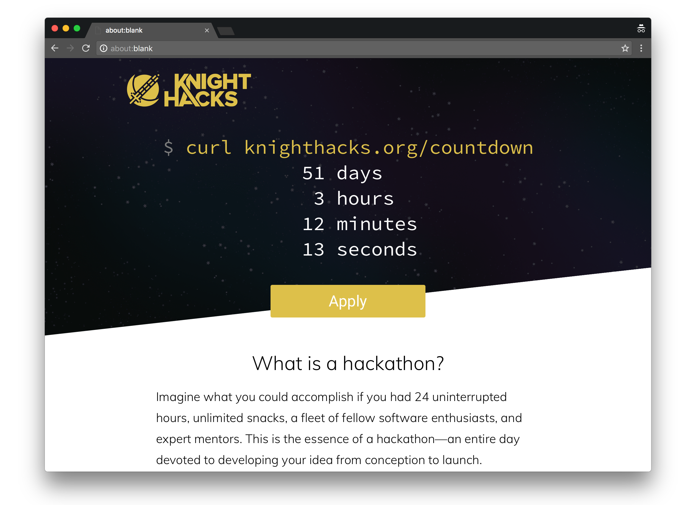

# KnightHacks Website



The KnightHacks website is a Rails 5 app.

### Setup

1. Get the code.

  ```sh
  git clone git@github.com:knighthacks/knighthacks-web.git
  ```

2. Set up your environment.
  ```sh
  bin/setup
  ```

3. Follow the instructions in `.env` to set up environment variables.

4. Install and start [Redis].

  ```sh
  brew install redis
  # Pay attention to the output, the startup command may differ.
  brew services start redis
  ```

5. Start [Foreman] (or any [Procfile]-based runner).
  ```sh
  bin/foreman start
  ```

6. Start [Guard] for live reloading.
  ```sh
  bin/guard
  ```

[Redis]: https://redis.io
[Foreman]: https://github.com/ddollar/foreman
[Procfile]: https://devcenter.heroku.com/articles/procfile
[Guard]: https://github.com/guard/guard

### Ongoing

* Run RuboCop before committing. There's a comprehensive style guide for this project.

  ```
  rubocop
  ```
